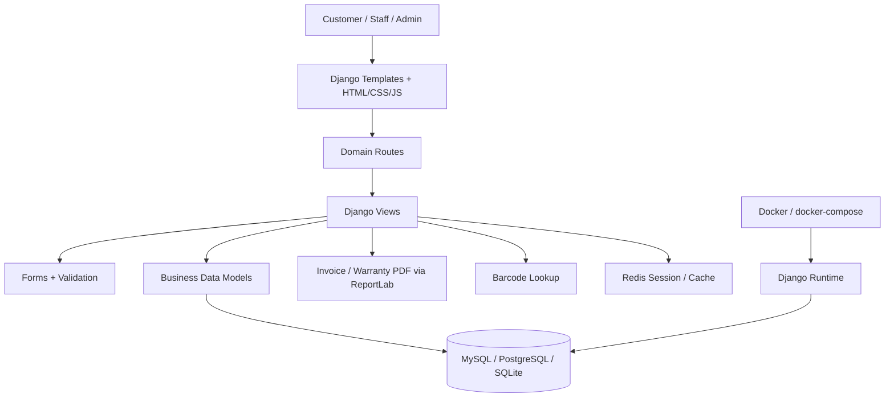

# Enterprise Business Prototype — CuaHangTrangSuc

## 1. Executive Positioning

**CuaHangTrangSuc** is positioned as an enterprise-style business management prototype for a jewelry retail operation. It is not only an online storefront. It models multiple operational layers of a real business: product management, counters, staff assignment, invoice flow, promotions, customer loyalty, buy-back, barcode lookup, revenue pages, dashboard, database migration, Docker-based runtime, and security baseline.

**Current classification:** Enterprise-grade business prototype.

**Not yet claimed:** Fully production-hardened enterprise platform.

The purpose of this file is to make the enterprise evidence visible to reviewers, teachers, customers, and technical evaluators without forcing them to inspect the whole codebase manually.

---

## 2. Business Domain Map

| Domain | Evidence in project | Business meaning |
|---|---|---|
| Product management | `SanPham`, product pages | Manage sellable jewelry items |
| Sales counter | `QuayBanHang` | Organize retail counter operations |
| Staff management | `NhanVien` | Assign staff to operational counters |
| Invoice flow | `HoaDon`, `ChiTietHoaDon` | Track sales transactions |
| Promotions | `KhuyenMai`, `UuDaiKhachHang` | Manage company and customer discounts |
| Customer loyalty | `TichDiem` | Reward repeat customers |
| Buy-back flow | `MuaLai` | Support jewelry repurchase workflow |
| Gold price | `GiaVang` | Represent market-sensitive jewelry pricing data |
| Barcode lookup | `barcode_scanner`, barcode routes | Fast product lookup and retail scanning |
| Reporting/dashboard | `doanhthu`, `dashboard` routes | Business monitoring layer |

---

## 3. System Architecture Snapshot

### Current runtime stack

- Backend: Django / Python.
- Frontend: HTML, CSS, JavaScript, Bootstrap-style templates.
- Database: MySQL in current settings; README also describes PostgreSQL / SQLite compatibility.
- Cache/session layer: Redis through `django-redis`.
- Container base: Dockerfile + docker-compose.
- Document generation: ReportLab for invoice and warranty PDF flows.
- Test/proof layer: GitHub Actions workflow and Django model tests added in this enterprise prototype package.

---

## 4. Evidence Matrix

| Enterprise signal | Status | Proof path |
|---|---|---|
| Multi-domain business model | Present | `Quanlybanhang/models.py` |
| Database migrations | Present | `Quanlybanhang/migrations/` |
| Docker runtime | Present | `Python - Copy/Dockerfile`, `Python - Copy/docker-compose.yml` |
| Security middleware base | Present | `Bantrangsuc/settings.py` |
| Password validation | Present | `Bantrangsuc/settings.py` |
| Redis session/cache | Present | `Bantrangsuc/settings.py` |
| CI pipeline | Added | `.github/workflows/enterprise-ci.yml` |
| Business model test suite | Added | `Quanlybanhang/tests/test_business_models.py` |
| RBAC hardening | Roadmap | Needs role matrix implementation |
| Production security hardening | Roadmap | Needs env-based secrets, DEBUG false, strict host config |

---

## 5. Migration Strategy

The project already uses Django migrations to control database schema evolution. This is important because enterprise systems cannot rely on manual table edits. Schema changes must be tracked, replayable, reversible where possible, and reviewable.

### Current migration evidence

- Initial business tables are generated through Django migrations.
- Later business expansion, such as customer points, is represented as a separate migration.
- Migration files allow reviewers to track how the data model evolved over time.

### Enterprise improvement target

Add a `docs/migration-strategy.md` file later with:

1. Migration naming rules.
2. Backup-before-migrate policy.
3. Staging migration checklist.
4. Rollback strategy.
5. Data migration convention.

---

## 6. Security Baseline

The project already contains a Django security baseline:

- CSRF middleware.
- Authentication middleware.
- Clickjacking protection middleware.
- Password validators.
- Session/cache separation through Redis.

### Production hardening gap

The current codebase should not claim production security until these are completed:

1. Move `SECRET_KEY` to environment variables.
2. Set `DEBUG=False` in production.
3. Replace wildcard `ALLOWED_HOSTS` with explicit domains.
4. Move database credentials to environment variables.
5. Add `CSRF_COOKIE_SECURE=True` for HTTPS production.
6. Add `SESSION_COOKIE_SECURE=True` for HTTPS production.
7. Add `SECURE_SSL_REDIRECT=True` behind a proper HTTPS proxy.
8. Define role-based access control for admin/staff/customer flows.

---

## 7. RBAC Target Model

| Role | Access scope |
|---|---|
| Admin | Full system configuration, staff, products, promotions, revenue, dashboard |
| Manager | Products, counters, invoices, promotions, loyalty, reports |
| Staff | Counter operations, barcode lookup, invoice creation, customer lookup |
| Customer | Product browsing, cart/order flow, points visibility |
| Auditor | Read-only access to revenue, invoices, product logs |

### RBAC implementation target

Use Django Groups and Permissions:

- `group_admin`
- `group_manager`
- `group_staff`
- `group_customer`
- `group_auditor`

Add decorators or permission mixins:

- `@login_required`
- `@permission_required(...)`
- `user_passes_test(...)`

---

## 8. Customer Demo Flow

Use this order when presenting the prototype to a customer or evaluator:

1. Show dashboard to establish business overview.
2. Show product catalog and inventory.
3. Show sales counter management.
4. Assign staff to a counter.
5. Create or inspect invoice flow.
6. Generate invoice/warranty PDF.
7. Show promotion workflow.
8. Approve customer discount.
9. Add customer loyalty points.
10. Redeem loyalty points for product benefit.
11. Demonstrate barcode product lookup.
12. Explain migration, Docker, Redis, security baseline, and CI/test proof.

---

## 9. Enterprise Verdict

This project has crossed the line from student CRUD into enterprise-style business system prototyping because it includes:

- multiple business domains,
- relational data model,
- migration history,
- operational routes,
- Docker runtime,
- Redis-backed session/cache direction,
- security middleware baseline,
- invoice/warranty document generation,
- CI/testing proof layer.

The correct external positioning is:

> **Enterprise-grade business prototype for jewelry retail operations.**

The correct internal next target is:

> **Convert enterprise prototype into customer-verifiable production proof.**

---

## 10. Next Actions

1. Add RBAC implementation.
2. Move secrets and database credentials into environment variables.
3. Add `docs/security-hardening.md`.
4. Add `docs/rbac.md`.
5. Add API or endpoint documentation.
6. Add screenshots of successful GitHub Actions runs.
7. Add a 3-minute customer demo video following the demo flow above.
8. Add deployment evidence for staging and production.
