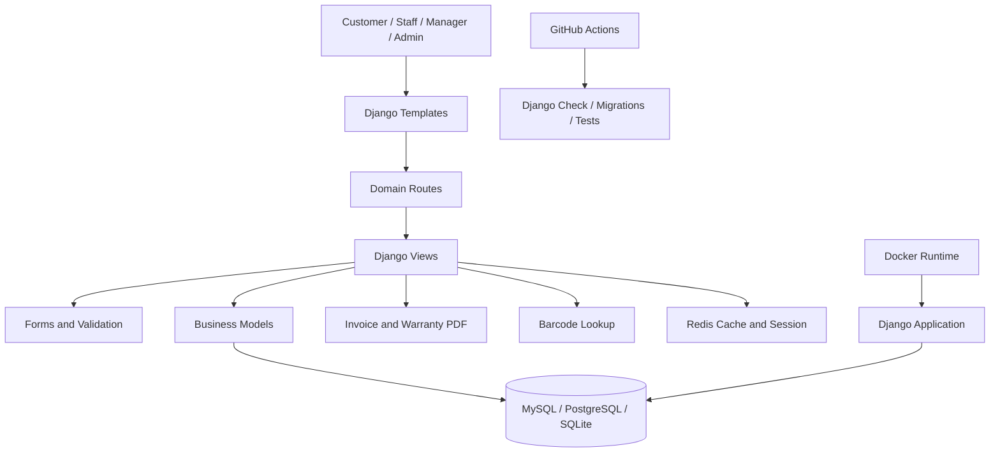

# Portfolio Case Study — CuaHangTrangSuc

## Trần Thế Hảo — Enterprise Business Prototype Builder

**Project:** CuaHangTrangSuc  
**Type:** Jewelry retail business management system  
**Role:** Full-stack developer, business-system designer, enterprise prototype builder  
**Stack:** Django, Python, HTML, CSS, JavaScript, MySQL/PostgreSQL/SQLite direction, Redis, Docker, GitHub Actions  
**Status:** Enterprise-grade business prototype

---

## 1. Portfolio Summary

CuaHangTrangSuc is an enterprise-style business prototype for jewelry retail operations. The system is designed beyond a normal storefront: it models business entities, internal staff workflows, product inventory, counters, invoices, promotions, customer loyalty, buy-back operations, barcode lookup, reporting pages, migration history, Docker runtime, security baseline, and CI proof.

This project demonstrates my ability to convert a business domain into a structured software system with operational logic, database schema, deployment direction, and customer-facing proof packaging.

---

## 2. Business Problem

Jewelry retail operations are not limited to product display and checkout. A real store needs to manage:

- products and inventory,
- sales counters,
- staff responsibility,
- customer records,
- invoices,
- promotions,
- loyalty points,
- product buy-back,
- barcode/product lookup,
- revenue/reporting views,
- database evolution,
- access control and security direction.

The project solves this by modeling the jewelry shop as a business operating system prototype rather than a simple CRUD app.

---

## 3. My Role

I handled the project as a system builder:

- mapped business modules into Django apps, models, views, routes, and templates,
- designed the core business data model,
- implemented operational workflows for product, counter, staff, invoice, promotion, loyalty, and buy-back logic,
- added Docker runtime direction,
- prepared CI/CD proof using GitHub Actions,
- packaged the project into an enterprise-readable portfolio and proof file.

---

## 4. System Scope

| Module | Purpose |
|---|---|
| Product Management | Manage jewelry products and stock |
| Counter Management | Manage physical/operational sales counters |
| Staff Management | Assign employees to business counters |
| Invoice Management | Record sales transactions and invoice lines |
| Promotion Management | Manage product discounts and customer-specific offers |
| Customer Loyalty | Track points and reward customers |
| Buy-back Workflow | Support jewelry repurchase operations |
| Barcode Lookup | Search products quickly from scanned/input codes |
| Revenue Page | Prepare business reporting view |
| Dashboard | Present operational overview |
| Migration Layer | Track schema evolution through Django migrations |
| Docker Runtime | Package app runtime for repeatable deployment |
| CI Proof | Verify checks, migrations, and tests through GitHub Actions |

---

## 5. Architecture

---

## 6. Enterprise Signals

| Signal | Evidence |
|---|---|
| Multi-domain business system | Product, counter, staff, invoice, promotion, loyalty, buy-back, revenue, dashboard |
| Relational data modeling | Business entities connected through Django models |
| Migration control | Django migration history for schema evolution |
| Deployment direction | Dockerfile and docker-compose |
| Security baseline | Django middleware, CSRF, auth, password validators |
| Cache/session direction | Redis integration |
| CI/CD direction | GitHub Actions workflow for checks, migrations, tests |
| Customer proof packaging | Enterprise proof file and portfolio case study |

---

## 7. Technical Highlights

### Backend

- Django application structure.
- Domain-driven model separation.
- Business flows implemented through views and routes.
- Database-backed business operations.

### Data Layer

- Product, customer, staff, counter, invoice, promotion, loyalty, buy-back, and gold-price entities.
- ForeignKey and ManyToMany relationships.
- Django migration history.

### Runtime

- Dockerfile for containerized runtime.
- docker-compose service mapping.
- Redis cache/session direction.

### Proof Layer

- `ENTERPRISE_BUSINESS_PROTOTYPE.md` for enterprise proof.
- `.github/workflows/enterprise-ci.yml` for CI proof.
- `docs/test-suite-plan.md` for testing strategy.
- `docs/access-control-roadmap.md` for access-control roadmap.

---

## 8. Demo Flow for Interview or Customer Presentation

1. Open dashboard and explain business overview.
2. Show product management and inventory logic.
3. Show counter management.
4. Assign or inspect staff responsibility.
5. Create or inspect invoice flow.
6. Show invoice or warranty PDF generation direction.
7. Show promotions.
8. Show customer-specific discount approval.
9. Show loyalty points.
10. Show buy-back module.
11. Show barcode lookup.
12. Explain migration, Docker, Redis, CI, and security baseline.

---

## 9. What This Project Proves

This project proves that I can:

- read a real business domain,
- break the domain into system modules,
- design database entities and relationships,
- implement operational workflows,
- structure a Django application,
- package deployment direction,
- create enterprise proof documentation,
- turn a student project into a portfolio-grade business system prototype.

---

## 10. Current Limitation and Next Upgrade

This project is already an enterprise-grade prototype. The next upgrade is to convert it into a production-verifiable system by completing:

- role-based access control,
- environment-based secrets,
- strict production settings,
- route-level permission tests,
- passing CI badge,
- demo video,
- staging deployment evidence,
- customer feedback evidence.

---

## 11. Portfolio Positioning Statement

> I build AI-assisted and business-oriented software systems that connect real workflows, data models, automation, deployment, and enterprise proof. CuaHangTrangSuc is my enterprise business prototype case study for jewelry retail operations.
